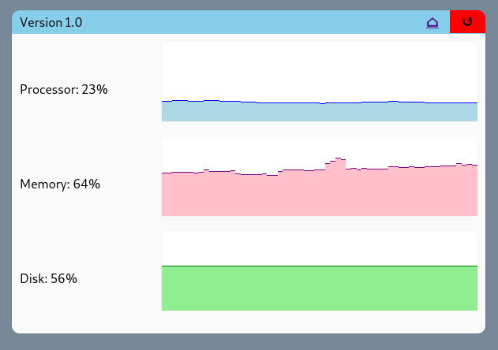

# Linux monitoring

<figure markdown>
  { loading=lazy }
  <figcaption>Screenshot of normal operation</figcaption>
</figure>

[Demo](https://frolov.eu/monitoring/){ .md-button .md-button--primary }
[Download](https://github.com/FlagHunter01/linux-monitoring/releases){ .md-button }

## Objective

This script monitors processor, memory and disk useage and displays them in a web interface. 

It aims to mimic the "Performance" tab of Windows Task Manager in a simplistic way, with the history going back one hour instead of one minute. 

## Limitations

This project has only been tested on Debian. Other flavors might need some tweaking. 

## Useage

To see the script in action, go to its web interface (by default, it's [localhost/monitoring/](http://=localhost/monitoring/)). 

You should see a window with 3 indications with their associated graphs:

 - Processor shows the time the processor isn't *idle*
 - Memory shows the memory useage
 - Disk shows the proportion of used disk space (not the *idle* proportion like for the processor)

The value is the latest measured metric (-1 means the last measure failed). 

The graph shows the history for the last hour. If a part of it is grayed out, it means that data wasn't avalible at this time (the machine was down for example). 

in the header part of the window, you can see the version number, an error message in red (when there is a problem) and two buttons.

 - The home button is a link to another page
 - The arrow button refreshes the page so you could see the latest data.
